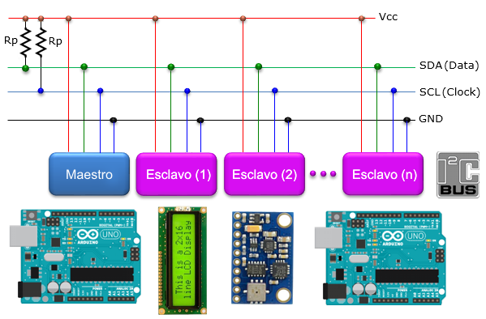
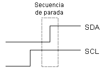

## Consigna.
a) Explique el funcionamiento del protocolo I2C? 

## Desarrollo.

## Definición de I2C (I2C)
Abreviatura de Inter-IC (inter integrated circuits), un tipo de bus diseñado por Philips Semiconductors a principios de los 80s, que se utiliza para conectar circuitos integrados (ICs). El I2C es un bus con múltiples maestros, lo que significa que se pueden conectar varios chips al mismo bus y que todos ellos pueden actuar como maestro, sólo con iniciar la transferencia de datos. Este bus se utiliza dentro de una misma placa de un dispositivo.

El bus I2C, un estándar que facilita la comunicación entre microcontroladores, memorias y otros dispositivos con cierto nivel de «inteligencia», sólo requiere de dos líneas de señal y un común o masa. Fue diseñado a este efecto por Philips y permite el intercambio de información entre muchos dispositivos a una velocidad aceptable, de unos 100 Kbits por segundo, aunque hay casos especiales en los que el reloj llega hasta los 3,4 MHz.

La metodología de comunicación de datos del bus I2C es en serie y sincrónica. Una de las señales del bus marca el tiempo (pulsos de reloj) y la otra se utiliza para intercambiar datos.

# Descripción de las señales

- SCL (System Clock) es la línea de los pulsos de reloj que sincronizan el sistema.
- SDA (System Data) es la línea por la que se mueven los datos entre los dispositivos.
- GND (Masa) común de la interconexión entre todos los dispositivos «enganchados» al bus.

Las líneas SDA y SCL son del tipo drenaje abierto, es decir, un estado similar al de colector abierto, pero asociadas a un transistor de efecto de campo (o FET). Se deben polarizar en estado alto (conectando a la alimentación por medio de resistores «pull-up») lo que define una estructura de bus que permite conectar en paralelo múltiples entradas y salidas.  

  

  

Las dos líneas del bus están en un nivel lógico alto cuando están inactivas. En principio, el número de dispositivos que se puede conectar al bus no tiene límites, aunque hay que observar que la capacidad máxima sumada de todos los dispositivos no supere los 400 pF. El valor de los resistores de polarización no es muy crítico, y puede ir desde 1K8 (1.800 ohms) a 47K (47.000 ohms). Un valor menor de resistencia incrementa el consumo de los integrados pero disminuye la sensibilidad al ruido y mejora el tiempo de los flancos de subida y bajada de las señales. Los valores más comunes en uso son entre 1K8 y 10K.

# Protocolo de comunicación del bus I2C

Habiendo varios dispositivos conectados sobre el bus, es lógico que para establecer una comunicación a través de él se deba respetar un protocolo. Digamos, en primer lugar, lo más importante: existen dispositivos maestros y dispositivos esclavos. Sólo los dispositivos maestros pueden iniciar una comunicación.

  

 

La condición inicial, de bus libre, es cuando ambas señales están en estado lógico alto. En este estado cualquier dispositivo maestro puede ocuparlo, estableciendo la condición de inicio (start). Esta condición se presenta cuando un dispositivo maestro pone en estado bajo la línea de datos (SDA), pero dejando en alto la línea de reloj (SCL).

El primer byte que se transmite luego de la condición de inicio contiene siete bits que componen la dirección del dispositivo que se desea seleccionar, y un octavo bit que corresponde a la operación que se quiere realizar con él (lectura o escritura).

Si el dispositivo cuya dirección corresponde a la que se indica en los siete bits (A0-A6) está presente en el bus, éste contesta con un bit en bajo, ubicado inmediatamente luego del octavo bit que ha enviado el dispositivo maestro. Este bit de reconocimiento (ACK) en bajo le indica al dispositivo maestro que el esclavo reconoce la solicitud y está en condiciones de comunicarse. Aquí la comunicación se establece en firme y comienza el intercambio de información entre los dispositivos.

 

 

Si el bit de lectura/escritura (R/W) fue puesto en esta comunicación a nivel lógico bajo (escritura), el dispositivo maestro envía datos al dispositivo esclavo. Esto se mantiene mientras continúe recibiendo señales de reconocimiento, y el contacto concluye cuando se hayan transmitido todos los datos.

 

 

En el caso contrario, cuando el bit de lectura/escritura estaba a nivel lógico alto (lectura), el dispositivo maestro genera pulsos de reloj para que el dispositivo esclavo pueda enviar los datos. Luego de cada byte recibido el dispositivo maestro (quien está recibiendo los datos) genera un pulso de reconocimiento.

El dispositivo maestro puede dejar libre el bus generando una condición de parada (o detención; stop en inglés).

Si se desea seguir transmitiendo, el dispositivo maestro puede generar otra condición de inicio en lugar de una condición de parada. Esta nueva condición de inicio se denomina «inicio reiterado» y se puede emplear para direccionar un dispositivo esclavo diferente o para alterar el estado del bit de lectura/escritura.

## Definición de términos:

- **Maestro (Master):** Dispositivo que determina los tiempos y la dirección del tráfico en el bus. Es el único que aplica los pulsos de reloj en la línea **SCL**. Cuando se conectan varios dispositivos maestros a un mismo bus la configuración obtenida se denomina «multi-maestro».
- **Esclavo (Slave):** Todo dispositivo conectado al bus que no tiene la capacidad de generar pulsos de reloj. Los dispositivos esclavos reciben señales de comando y de reloj generados desde el maestro.
- **Bus libre (Bus Free):** Estado en el que ambas líneas (SDA y SCL) están inactivas, presentando un estado lógico alto. Es el único momento en que un dispositivo maestro puede comenzar a hacer uso del bus.
- **Comienzo (Start):** Se produce cuando un dispositivo maestro ocupa el bus, generando la condición. La línea de datos (SDA) toma un estado bajo mientras que la línea de reloj (SCL) permanece alta.
- **Parada (Stop):** Un dispositivo maestro puede generar esta condición, dejando libre el bus. La línea de datos y la de reloj toman un estado lógico alto.
- **Dato válido (Valid Data):** Situación presente cuando un dato presente en la línea SDA es estable al tiempo que la línea SCL está a nivel lógico alto.
- **Formato de Datos (Data Format):** La transmisión de un dato a través de este bus consiste de 8 bits de dato (1 byte). A cada byte transmitido al bus le sigue un noveno pulso de reloj durante el cual el dispositivo receptor del byte debe generar un pulso de reconocimiento.
- **Reconocimiento (Acknowledge):** El pulso de reconocimiento, conocido como ACK (del inglés Acknowledge), se logra colocando la línea de datos a un nivel lógico bajo durante el transcurso del noveno pulso de reloj.
- **Dirección (Address):** Todo dispositivo diseñado para funcionar en este bus posee su propia y única dirección de acceso, preestablecida por el fabricante. Hay dispositivos que permiten definir externamente parte de la dirección de acceso, lo que habilita que se pueda conectar en un mismo bus un conjunto de dispositivos del mismo tipo, sin problemas de identificación. La dirección 00 es la denominada «de acceso general»; a ésta responden todos los dispositivos conectados al bus.
- **Lectura/Escritura (Bit R/W):** Cada dispositivo tiene una dirección de 7 bits. El octavo bit (el menos significativo) que se envía durante la operación de direccionamiento, completando el byte, indica el tipo de operación a realizar. Si este bit es alto el dispositivo maestro lee información proveniente de un dispositivo esclavo. Si este bit es bajo, el dispositivo maestro escribe información en un dispositivo esclavo.

# La comunicación en más detalle

Cuando el dispositivo maestro quiere comunicarse con un esclavo, produce una secuencia de inicio en el bus. La secuencia de inicio es una de las dos secuencias especiales que se han definido en el bus I2C; la otra es la secuencia de parada. Las secuencias de inicio y la de parada son especiales porque son los dos únicos casos en que se permite que la línea de datos (**SDA**) cambie cuando la línea de reloj (**SCL**) está alta. Cuando se están transmitiendo datos, la línea SDA debe permanecer estable, y jamás cambiar, mientras la línea **SCL** está alta. Las secuencias de inicio y de parada señalan el comienzo y el final de una transacción con los dispositivos esclavos.

Los datos se transfieren en secuencias de 8 bits. Estos bits se colocan en la línea **SDA** comenzando por el bit de más peso (o más significativo). Una vez puesto un bit en **SDA**, se lleva la línea **SCL** a alto. Debemos recordar que el chip no puede llevar la línea a un estado alto, en realidad, lo que hace es «soltarla», y el que la pone en nivel lógico alto es el resistor de polarización. Por cada 8 bits que se transfieren, el dispositivo que recibe el dato envía de regreso un bit de reconocimiento, de modo que en realidad por cada byte de dato se producen 9 pulsos sobre la línea **SCL** (es decir, 9 pulsos de reloj por cada 8 bits de dato). Si el dispositivo que recibe envía un bit de reconocimiento bajo, indica que ha recibido el dato y que está listo para aceptar otro byte. Si retorna un alto, lo que indica es que no puede recibir más datos y el dispositivo maestro debería terminar la transferencia enviando una secuencia de parada.

# Direccionamiento de dispositivos en el bus I2C 
  

Lo más común en los dispositivos para el bus I2C es que utilicen direcciones de 7 bits, aunque existen dispositivos de 10 bits. Este último caso es raro.

Una dirección de 7 bits implica que se pueden poner hasta 128 dispositivos sobre un bus I2C, ya que un número de 7 bits puede ir desde 0 a 127. Cuando se envían las direcciones de 7 bit, de cualquier modo la transmisión es de 8 bits. El bit extra se utiliza para informarle al dispositivo esclavo si el dispositivo maestro va a escribir o va a leer datos desde él. Si el bit de lectura/escritura (R/W) es cero, el dispositivo maestro está escribiendo en el esclavo. Si el bit es 1 el maestro está leyendo desde el esclavo. La dirección de 7 bit se coloca en los 7 bist más significativos del byte y el bit de lectura/escritura es el bit menos significativo.

El hecho de colocar la dirección de 7 bits en los 7 bits más significativos del byte produce confusiones entre quienes comienzan a trabajar con este bus. Si, por ejemplo, se desea escribir en la dirección 21 (hexadecimal), en realidad se debe enviar un 42, que es un 21 desplazado un bit hacia arriba. También se pueden tomar las direcciones del bus I2C como direcciones de 8 bit, en las que las pares son de sólo escritura y las impares son de sólo lectura. Para dar un ejemplo, el integrado de brújula magnética CMPS03 es fijado en fábrica en la dirección 0xC0 ($C0). La dirección 0xC0 se utiliza para escribir en él y la dirección 0xC1 es para leer de él.

# Protocolo de programación para el bus I2C

Lo primero que ocurre en un bus I2C es que el dispositivo maestro envía una secuencia de inicio. Esto alerta a los dispositivos esclavos, poniéndolos a la espera de una transacción. Éstos quedan atentos para ver si se trata de una solicitud para ellos. A continuación el dispositivo maestro envía la dirección de dispositivo. El dispositivo esclavo que posee esa dirección continuará con la transacción, y los otros ignorarán el resto de los intercambios, esperando la próxima secuencia de inicio.

Habiendo direccionado ya el dispositivo esclavo, lo que debe hacer ahora el maestro es enviar la ubicación interna o número de registro desde el que desea leer o al que va a escribir. La cantidad depende, obviamente, de qué dispositivo es y de cuántos registros internos posee. Algunos dispositivos muy simples no tienen ninguno, pero la mayoría sí los poseen.

Siguiendo con el ejemplo del CMPS03, éste posee 16 ubicaciones internas, numeradas desde el 0 al 15. Otro dispositivo, el medidor ultrasónico de distancia SRF08, tiene 36 registros.

Una vez que el maestro ha enviado la dirección del dispositivo en el bus I2C y la dirección del registro interno del dispositivo, puede enviar ahora el byte o bytes de datos. El dispositivo maestro puede seguir enviando bytes al esclavo, que normalmente serán puestos en registros con direcciones sucesivas, ya que el esclavo incrementa automáticamente la dirección del registro interno después de recibir cada byte. Cuando el maestro ha terminado de escribir datos en el esclavo, envía una secuencia de parada que concluye la transacción.

## Escritura en un dispositivo esclavo:

1. Enviar una secuencia de inicio
2. Enviar la dirección de dispositivo con el bit de lectura/escritura en bajo
3. Enviar el número de registro interno en el que se desea escribir
4. Enviar el byte de dato
5. [Opcionalmente, enviar más bytes de dato]
6. Enviar la secuencia de parada  

Como ejemplo, veamos un SRF08, que tiene una dirección de bus fijada en fábrica de 0xE0. Para comenzar una medición de distancia con el SRF08 se debe escribir 0x51 en el registro de comando, ubicado en la dirección interna 0x00. La secuencia es la que sigue:

1. Enviar una secuencia de inicio
2. Enviar 0xE0 (La dirección de dispositivo del SRF08 con el bit de lectura/escritura en bajo)
3. Enviar 0x00 (dirección interna del registro de comando)
4. Enviar 0x51 (el comando para comenzar la medición del SRF08)
5. Enviar la secuencia de parada

## Lectura desde un dispositivo esclavo:

Esta operación es algo más complicada, pero no demasiado. Antes de leer datos desde el dispositivo esclavo, primero se le debe informar desde cuál de sus direcciones internas se va a leer. De manera que una lectura desde un dispositivo esclavo en realidad comienza con una operación de escritura en él. Es igual a cuando se desea escribir en él: Se envía la secuencia de inicio, la dirección de dispositivo con el bit de lectura/escritura en bajo y el registro interno desde el que se desea leer. Ahora se envía otra secuencia de inicio nuevamente con la dirección de dispositivo, pero esta vez con el bit de lectura/escritura en alto. Luego se leen todos los bytes necesarios y se termina la transacción con una secuencia de parada.

Volviendo al ejemplo del módulo de brújula CMPS03, veamos cómo se lee el registro de ángulo:

1. Enviar una secuencia de inicio
2. Enviar 0xC0 (La dirección de dispositivo del CMPS03 con el bit de lectura/escritura en bajo)
3. Enviar 0x01 (dirección interna del registro de ángulo en valor 0-255)
4. Enviar una secuencia de inicio (inicio reiterado)
5. Enviar 0xC1 (La dirección de dispositivo del CMPS03 con el bit de lectura/escritura en alto)
6. Leer un byte de dato desde el CMPS03
7. Enviar la secuencia de parada  

 

 

*Fuente: https://robots-argentina.com.ar*