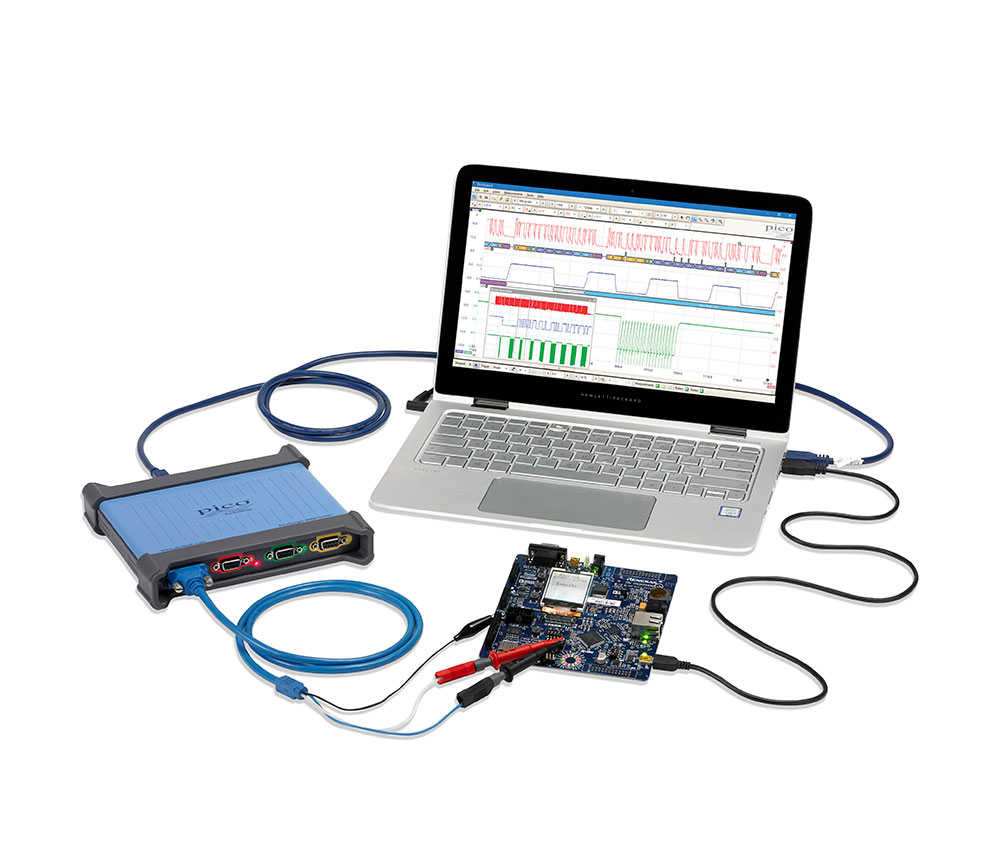
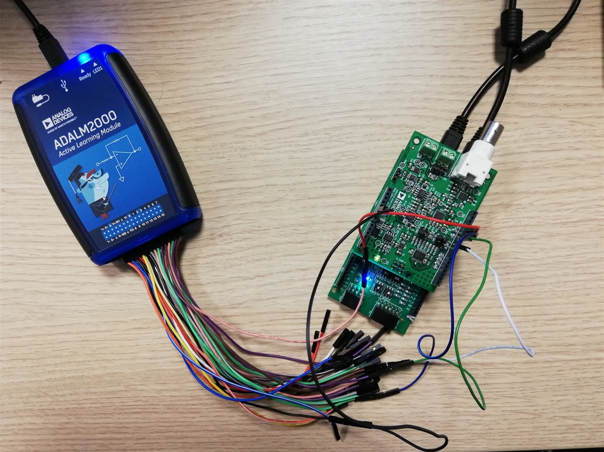
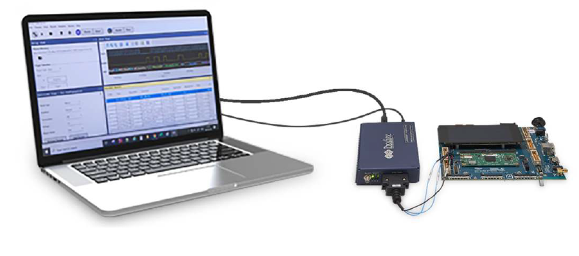
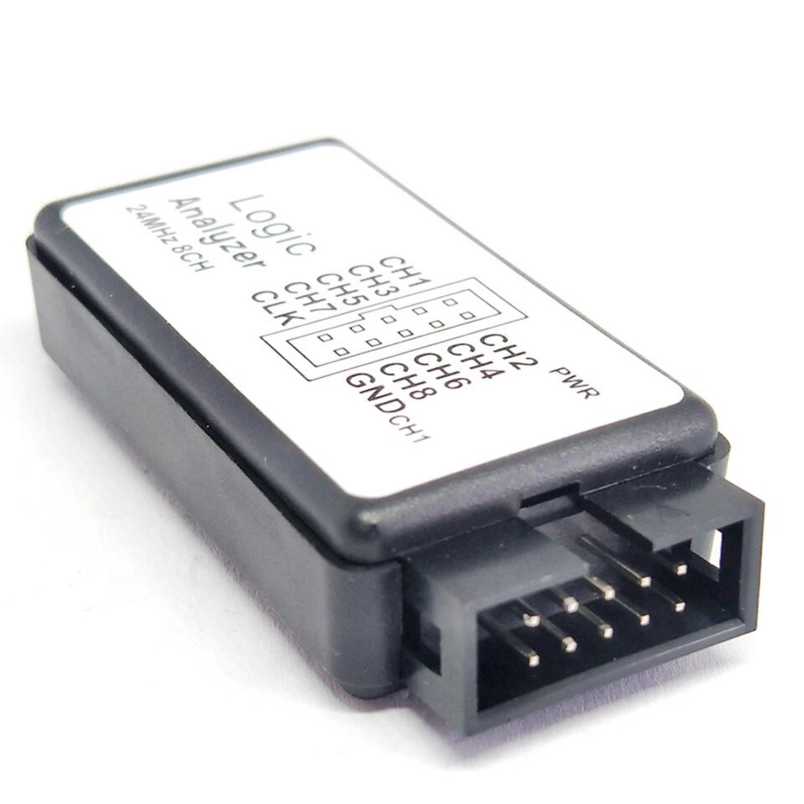
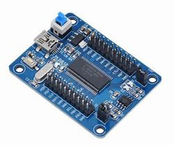
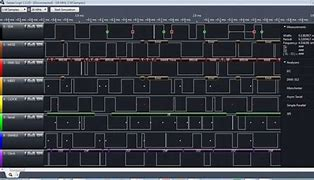
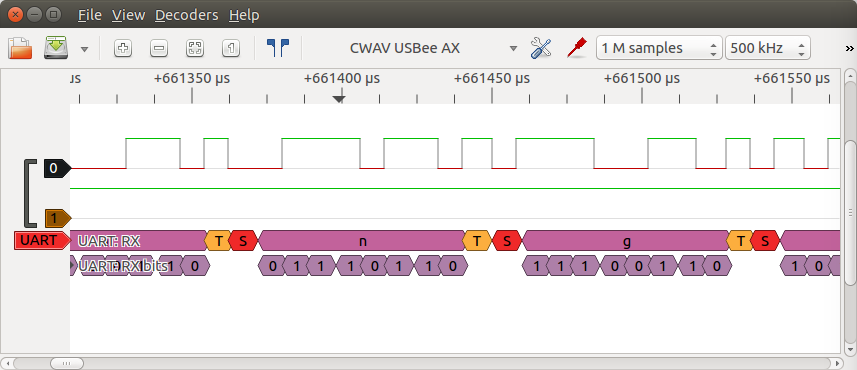
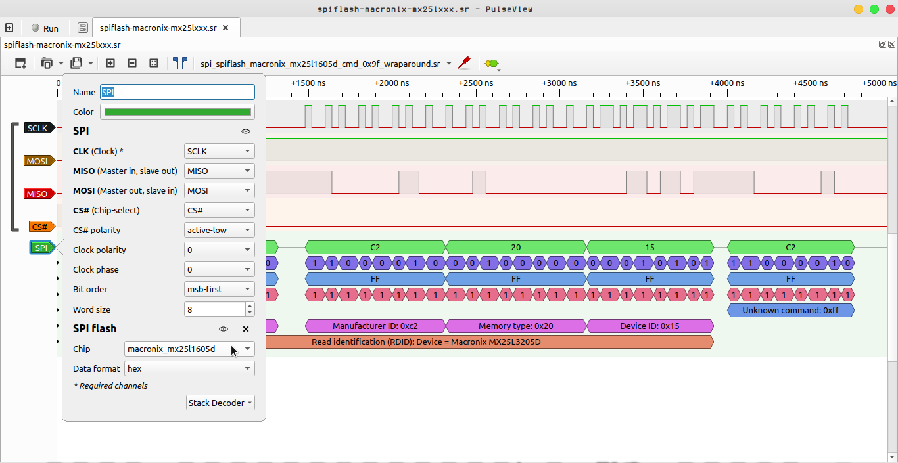
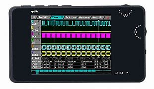
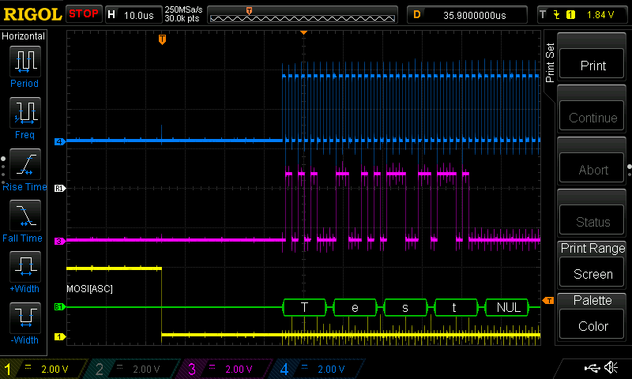

## Consigna.
c) Como probaría si una comunicación SPI funciona correctamente en su
laboratorio?

## Desarrollo.

Para realizar las pruebas de comunicación SPI en el laboratorio, al igual que con otros protocolos, podemos utilizar los debugger diseñados para tal fin.

Estos intrumentos son fabricados y vendidos con su propio software para brindar la mejor experiencia posible en la tarea de debuggear.

Por otro lado, para realizar la depuración en un bus de datos se puede utilizar un analizador lógico, el cual al ser usado con un software de visualización nos dara la posibilidad de comprobar dicha comunicación.
Algunos ejemplos de analizadores logicos los muestro a continuación.

Los softwares que se pueden utilizar para la visualización de la captura de datos pueden ser PULSEVIEW-SIGROK o el software de SALEAE, entre otros.

Entre los analizadores lógicos existen algunos que son equipos completos dedicados a tal fin, y cuentan con display propio, expansion de almacenamiento y algunos traen salidas de video para proyectar la imagen en pantallas externas.

Otra herramienta que nos permite realizar la decodificación de un protocolo a traves de la lectura del estado del bus de datos es el osciloscopio, ya que muchos modelos cuentan con dicha función en el firmware y su implementación física se realiza a traves de tarjetas de expansión o periféricos que se conectan a el.

El uso de los mismos consta de conectar la punta "gnd" del osciloscopio, analizador lógico o debugger en la tierra del bus de datos a analizar, y la punta o las puntas de prueba del canal o canales seleccionados al bus de datos.
De esta forma, la punta de prueba obtiene los altos y bajos del bus y el firmware se encarga de hacer la "traducción" correspondiente. Se debe tener especial cuidado en los valores admitidos por cada herramienta para no generar daños en la misma.